# 执行计划

## 详细分析摘要

### 变更影响评估
- **用户界面变更**: 是 — 全新 Web 平台，面向全球用户，中英双语
- **结构性变更**: 是 — 全新系统架构（前后端分离，混合数据库）
- **数据模型变更**: 是 — 全新数据库设计（PostgreSQL + MongoDB + Elasticsearch）
- **API 变更**: 是 — 全新 RESTful API 设计
- **NFR 影响**: 是 — 性能、安全、国际化、CDN、多媒体存储

### 风险评估
- **风险级别**: 中等
- **回滚复杂度**: 低（全新项目，无遗留系统依赖）
- **测试复杂度**: 中等（多组件集成、多媒体处理、搜索引擎）

---

## 工作流可视化

```mermaid
flowchart TD
    Start(["用户请求"])
    
    subgraph INCEPTION["🔵 INCEPTION 阶段"]
        WD["工作区检测<br/><b>已完成 ✅</b>"]
        RA["需求分析<br/><b>已完成 ✅</b>"]
        US["用户故事<br/><b>已完成 ✅</b>"]
        WP["工作流规划<br/><b>进行中 🔄</b>"]
        AD["应用设计<br/><b>执行 ▶</b>"]
        UG["单元生成<br/><b>执行 ▶</b>"]
    end
    
    subgraph CONSTRUCTION["🟢 CONSTRUCTION 阶段"]
        FD["功能设计<br/><b>执行 ▶</b>"]
        NFRA["NFR 需求<br/><b>执行 ▶</b>"]
        NFRD["NFR 设计<br/><b>执行 ▶</b>"]
        ID["基础设施设计<br/><b>执行 ▶</b>"]
        CG["代码生成<br/><b>执行 ▶</b>"]
        BT["构建与测试<br/><b>执行 ▶</b>"]
    end
    
    Start --> WD
    WD --> RA
    RA --> US
    US --> WP
    WP --> AD
    AD --> UG
    UG --> FD
    FD --> NFRA
    NFRA --> NFRD
    NFRD --> ID
    ID --> CG
    CG -.->|下一单元| FD
    CG --> BT
    BT --> End(["完成"])
    
    style WD fill:#4CAF50,stroke:#1B5E20,stroke-width:3px,color:#fff
    style RA fill:#4CAF50,stroke:#1B5E20,stroke-width:3px,color:#fff
    style US fill:#4CAF50,stroke:#1B5E20,stroke-width:3px,color:#fff
    style WP fill:#4CAF50,stroke:#1B5E20,stroke-width:3px,color:#fff
    style AD fill:#FFA726,stroke:#E65100,stroke-width:3px,stroke-dasharray: 5 5,color:#000
    style UG fill:#FFA726,stroke:#E65100,stroke-width:3px,stroke-dasharray: 5 5,color:#000
    style FD fill:#FFA726,stroke:#E65100,stroke-width:3px,stroke-dasharray: 5 5,color:#000
    style NFRA fill:#FFA726,stroke:#E65100,stroke-width:3px,stroke-dasharray: 5 5,color:#000
    style NFRD fill:#FFA726,stroke:#E65100,stroke-width:3px,stroke-dasharray: 5 5,color:#000
    style ID fill:#FFA726,stroke:#E65100,stroke-width:3px,stroke-dasharray: 5 5,color:#000
    style CG fill:#4CAF50,stroke:#1B5E20,stroke-width:3px,color:#fff
    style BT fill:#4CAF50,stroke:#1B5E20,stroke-width:3px,color:#fff
    style INCEPTION fill:#BBDEFB,stroke:#1565C0,stroke-width:3px,color:#000
    style CONSTRUCTION fill:#C8E6C9,stroke:#2E7D32,stroke-width:3px,color:#000
    style Start fill:#CE93D8,stroke:#6A1B9A,stroke-width:3px,color:#000
    style End fill:#CE93D8,stroke:#6A1B9A,stroke-width:3px,color:#000
    linkStyle default stroke:#333,stroke-width:2px
```



### 文本替代方案
```
INCEPTION 阶段:
  ✅ 工作区检测 (已完成)
  ✅ 需求分析 (已完成)
  ✅ 用户故事 (已完成)
  🔄 工作流规划 (进行中)
  ▶ 应用设计 (待执行)
  ▶ 单元生成 (待执行)

CONSTRUCTION 阶段 (每个单元循环):
  ▶ 功能设计 (待执行)
  ▶ NFR 需求 (待执行)
  ▶ NFR 设计 (待执行)
  ▶ 基础设施设计 (待执行)
  ▶ 代码生成 (待执行)
  ▶ 构建与测试 (待执行)
```

---

## 阶段执行计划

### 🔵 INCEPTION 阶段
- [x] 工作区检测 (已完成)
- [x] 需求分析 (已完成)
- [x] 用户故事 (已完成)
- [x] 工作流规划 (进行中)
- [ ] **应用设计 — 执行**
  - **理由**: 全新项目，需要定义组件架构、服务层设计、组件间依赖关系。涉及前端组件、后端服务、数据层、搜索引擎、文件存储等多个组件。
- [ ] **单元生成 — 执行**
  - **理由**: 系统涉及多个独立模块（用户认证、内容管理、展示前端、搜索服务、评价系统、社区论坛、后台管理），需要分解为可独立开发的工作单元。

### 🟢 CONSTRUCTION 阶段（每个单元循环）
- [ ] **功能设计 — 执行**
  - **理由**: 每个单元包含业务逻辑（RBAC 权限、内容状态管理、评价规则、论坛逻辑），需要详细的领域模型和业务规则设计。
- [ ] **NFR 需求 — 执行**
  - **理由**: 涉及性能（CDN、搜索优化）、安全（认证授权、文件上传校验）、国际化、可扩展性等多项非功能需求。
- [ ] **NFR 设计 — 执行**
  - **理由**: NFR 需求已确认，需要将 NFR 模式融入组件设计（缓存策略、安全中间件、i18n 架构等）。
- [ ] **基础设施设计 — 执行**
  - **理由**: AWS 部署涉及多种服务（EC2/ECS、RDS、S3、CloudFront、Elasticsearch），需要明确基础设施架构。
- [ ] **代码生成 — 执行（必须）**
  - **理由**: 核心实现阶段
- [ ] **构建与测试 — 执行（必须）**
  - **理由**: 确保代码质量和功能正确性

### 🟡 OPERATIONS 阶段
- [ ] 运维 — 占位（未来扩展）

---

## 成功标准
- **主要目标**: 交付可运行的非遗博物馆 MVP Web 平台
- **关键交付物**: 
  - React/Next.js 前端应用（中英双语、响应式）
  - Django REST API 后端
  - PostgreSQL + Elasticsearch 数据层
  - Docker Compose 本地运行环境
  - 完整的测试套件
- **质量门禁**:
  - 所有 MVP 用户故事的验收标准通过
  - 单元测试覆盖率 > 70%
  - 页面加载时间 < 3 秒
  - API 响应时间 < 500ms (P95)
